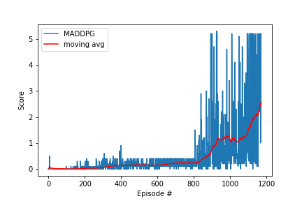

## Learning Algorithm

To solve this project Multi Agent Deep Deterministic Policy Gradient algorithm was used. The details of the algorithm can be found in the paper given by OpenAI: Multi-Agent Actor-Critic for Mixed Cooperative-Competitive Environments

The network shows two different Actors (Multi-agents) and a single Critic. MADDPG is a policy-based method which are well suited for continuous action spaces such as our Tennis environment and can learn stochastic policies.

In contrast to DDPG instead of training each agent to learn from its own actions, MADDPG incorporates actions taken by all the agents. The environment state depends on the actions taken by all agents (collaboration of the tennis players to maximize rewards) so if we train an agent using just its own action the policy network does not get enough information to come up with a good policy. MADDPG improves upon DDPG by sharing the actions taken by all agents to train each agent.

# Actor-Critic Method

Actor-critic methods leverage the strengths of both policy and value based methods.

The Actor uses a policy-based approach and learns how to act by directly estimating the optimal policy and maximizing reward through gradient ascent. Critic uses a value-based approach and learns how to estimate the value, the future cumulative reward, of different state-action pairs. Actor-critic agents are more stable than value-based agents, while requiring fewer training samples than policy-based agents and accelerates the learning process.

# Model Architecture

# The model for the Actor_Network is as follows:

(fc1) = nn.Linear(48, 256)
(fc2) = nn.Linear(256, 128)
(fc3) = nn.Linear(128, 2)
where (fc1) and (fc2) are followed by ReLU and (fc3) is followed by Tanh activation functions.

# The model for the Critic_Network is as follows:

(fcs1) = nn.Linear(48, 256)
(fc2) = nn.Linear(256+4, 126)
(fc3) = nn.Linear(126, 1)
where (fcs1) and (fc2) are followed by ReLU activation function

# Training Performance

# Testing Performance

# PERFORMANCE IMPROVEMENT

# LEARNING RATE WITH 1E-4 OR LESS
# KEEPING LEARING RATE DIFFERENT BETWEEN 2 AGENTS 
# INCREASE EPOCHS 
# DENSE NETWORK
# Apply following algorithms to compare with MADDPG:PPO,A3C,D4PG

